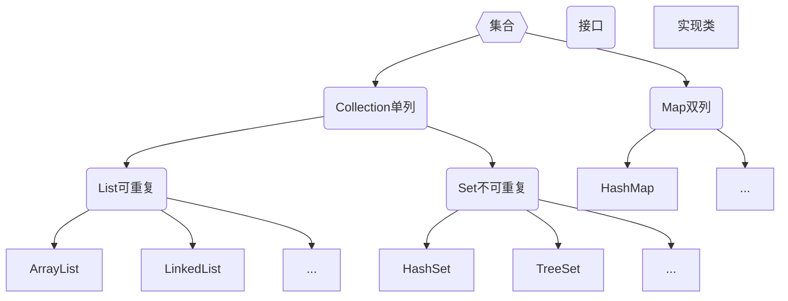

---

---

```mermaid
graph TD
集合{{集合}} --> Collection(Collection单列)
集合 --> Map(Map双列)
Collection --> List(List可重复)
Collection --> Set(Set不可重复)
List --> ArrayList[ArrayList]
List --> LinkedList[LinkedList]
List --> ...[...]
Set --> HashSet[HashSet]
Set --> TreeSet[TreeSet]
Set --> ....[...]
Map --> HashMap[HashMap]
Map --> .....[...]

a(接口)
b[实现类]
```

